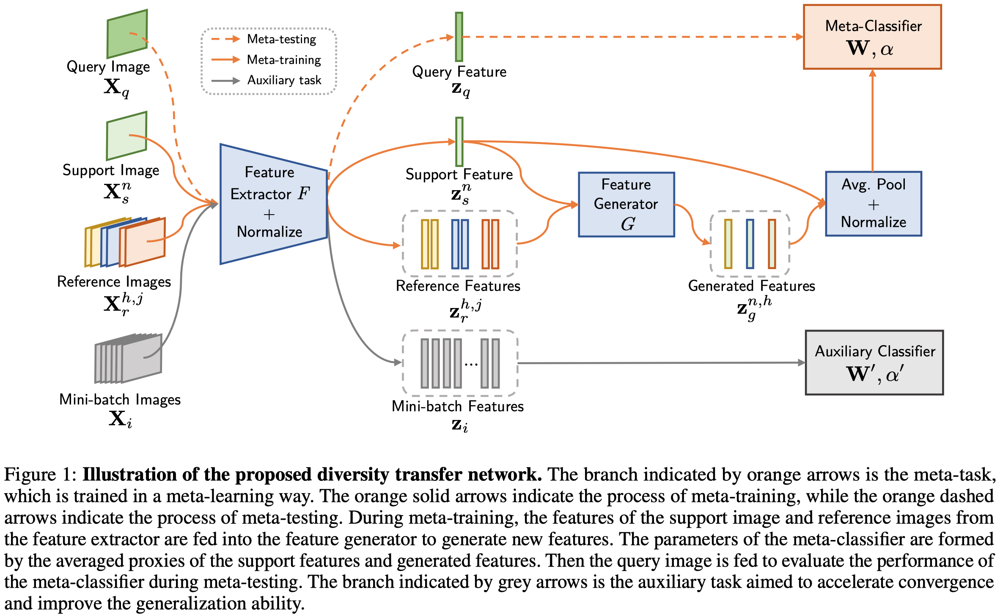
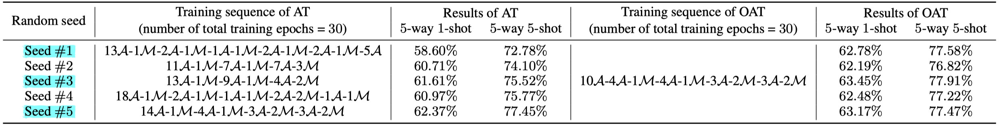

# Diversity Transfer Network for Few-Shot Learning

Pytorch implementation for ["Diversity Transfer Network for Few-Shot Learning"](http://arxiv.org/abs/1912.13182) (deep backbone, on miniImageNet).

We also provide our trainded models.

## Introduction

Few-shot learning is a challenging task that aims at training a classifier for unseen classes with only a few training examples. The main difficulty of few-shot learning lies in the lack of intra-class diversity within insufficient training samples. 

To alleviate this problem, we propose a novel generative framework, Diversity Transfer Network (DTN), that learns to transfer latent diversities from known categories and composite them with support features to generate diverse samples for novel categories in feature space. The learning problem of the sample generation (i.e., diversity transfer) is solved via minimizing an effective meta-classification loss in a single-stage network, instead of the generative loss in previous works. 

Besides, an organized auxiliary task co-training(OAT) over known categories is proposed to stabilize the meta-training process of DTN.



## Dataset Preprocessing & Evaluate our trained model on miniImageNet

Download the dataset from [this link](https://drive.google.com/open?id=1XapMobTsCSw9gyySt9D0GF_hOX_XpeZx), put the `images` folder in `./miniImageNet/`.

Run:

```bash
bash make.sh
```
We provide our trainded models for practitioners to reproduce our results listed in Table 3 of the [DTN paper](http://arxiv.org/abs/1912.13182).


## Train your DTN on miniImageNet

```
python main_DTN.py --checkpoint 'your_checkpoint'
```

## Evaluate your DTN on miniImageNet
```
# 5-way 5-shot
python main_DTN.py --N-way 5 --N-shot 5 --evaluate 1 --resume 'your_checkpoint/checkpoint.pth.tar'
# 5-way 1-shot
python main_DTN.py --N-way 5 --N-shot 1 --evaluate 1 --resume 'your_checkpoint/checkpoint.pth.tar'
```

## Citations
If you find DTN useful in your research, please consider citing:
```
@inproceedings{Chen2019DiversityTN,
  title={Diversity Transfer Network for Few-Shot Learning},
  author={Mengting Chen and Yuxin Fang and Xinggang Wang and Heng Luo and Yifeng Geng and Xinyu Zhang and Chang Huang and Wenyu Liu and Bo Wang},
  year={2019}
}
```

## License
DTN is released under the MIT license. See [LICENSE](LICENSE) for additional details.
## Acknowledgment
[Horizon Robotics](http://en.horizon.ai/)

## Thanks to the Third Party Libs
[Pytorch](https://github.com/pytorch/pytorch)   
